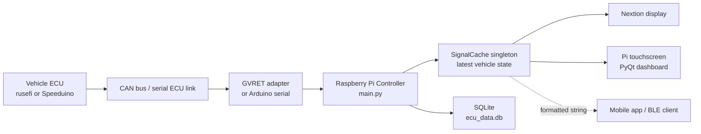
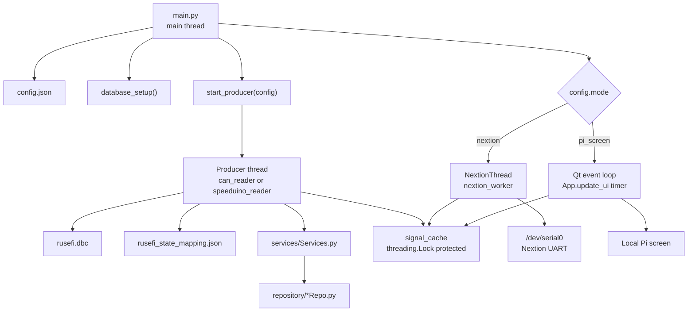

# CAN Platform Controller

Python controller for reading ECU data, decoding it into a normalized vehicle
state, displaying it locally or on a Nextion screen, and saving acquisition data
to SQLite.

## Overview

The controller starts from `main.py`.

Runtime flow:

1. Load `config.json`.
2. Create/update the SQLite schema in `ecu_data.db`.
3. Start a producer thread according to `config.type`.
4. Write the latest decoded vehicle state into the shared `signal_cache`
   singleton.
5. Start the configured consumer according to `config.mode`.
6. Persist all raw CAN frames and periodic `vehicle_state` snapshots.

Main modules:

| Path | Purpose |
| --- | --- |
| `main.py` | Application entrypoint and runtime mode selection. |
| `Producer/thread.py` | CAN/GVRET and Speeduino readers, DBC decode, state mapping. |
| `extra/signal_cache.py` | Thread-safe singleton with the latest normalized vehicle state. |
| `nextion/thread.py` | Sends vehicle state values to the Nextion display. |
| `UI/App.py` | PyQt dashboard for `pi_screen` mode. |
| `repository/` | SQLite persistence layer. |
| `repository/database/database_manager.py` | SQLite schema setup/cleanup. |
| `rusefi.dbc` | DBC used to decode rusefi CAN frames. |
| `rusefi_state_mapping.json` | Mapping from decoded DBC signals to controller vehicle state fields. |
| `init.sh` | Startup script intended for Raspberry Pi/systemd. |

## Distributed System Architecture

The platform is split into small nodes that communicate through serial links,
CAN frames, a local shared-memory cache, and SQLite persistence. The controller
is the central edge node: it receives ECU data, normalizes it, stores it, and
feeds whichever display or transmitter is enabled.



The important design point is that decoded state is not passed as a one-time
queue message anymore. Producers update `SignalCache`, and consumers read the
latest snapshot whenever they need it. This lets multiple consumers observe the
same state without stealing messages from each other.

## Thread And Dependency Model

At runtime, `main.py` owns process startup. It creates the database schema,
starts one producer thread, and starts one display mode. The shared dependency
between producers and consumers is `extra.signal_cache.signal_cache`.



### Runtime Threads

| Thread | Created by | Runs | Responsibilities |
| --- | --- | --- | --- |
| Main thread | Python process | `main.py` | Loads configuration, prepares SQLite, starts the producer and selected output mode. |
| Producer thread | `start_producer()` | `can_reader()` or `speeduino_reader()` | Reads ECU data, decodes/maps it, writes latest state to `signal_cache`, and stores CAN/state data. |
| Nextion thread | `start_nextion()` when `mode = nextion` | `nextion_worker()` | Reads the latest cache snapshot and sends text updates over the Nextion UART. |
| Qt event loop | `QApplication.exec_()` when `mode = pi_screen` | `App.update_ui()` timer | Reads the latest cache snapshot and refreshes the local dashboard. |

`SignalCache` uses a `threading.Lock`, so readers never observe a partially
updated dictionary while the producer is writing a new batch. It also keeps a
monotonic `_version` counter: every cache update increments it, and the Nextion
thread uses that value to avoid sending duplicate screen updates.

The cache preserves the older signal names used by other modules:

| New normalized field | Backwards-compatible alias |
| --- | --- |
| `clt` | `temp` |
| `battery_voltage` | `battery` |
| `advance` | `timing` |
| `tps` | `throttle` |

`get_formatted_string()` still emits the legacy BLE/mobile payload format:

```text
rpm,temp,afr,tps,map,battery,dwell,timing
```

## Configuration

The controller is configured with `config.json`.

There are two independent configuration concepts:

- `type`: where ECU data comes from.
- `mode`: where decoded state is sent/displayed.

### Producer Types

#### `rusefi_can`

Reads CAN frames through a GVRET-compatible serial adapter, decodes them with a
DBC file, saves raw CAN frames, maps decoded signals into vehicle state, and
saves periodic state snapshots.

Example:

```json
{
  "type": "rusefi_can",
  "mode": "nextion",
  "com": "/dev/serial/by-id/usb-Espressif_USB_JTAG_serial_debug_unit_58:E6:C5:10:77:9C-if00",
  "baud_rate": 2000000,
  "dbc": "./rusefi.dbc",
  "state_mapping": "./rusefi_state_mapping.json",
  "session_description": "CAN acquisition",
  "state_save_interval": 1.0,
  "log_can_activity": true,
  "can_log_interval": 5.0,
  "nextion_port": "/dev/serial0",
  "nextion_baud": 115200
}
```

Fields:

| Field | Required | Description |
| --- | --- | --- |
| `type` | Yes | Must be `rusefi_can`. |
| `com` | Yes | Serial device for the GVRET/CAN adapter. Prefer `/dev/serial/by-id/...` on Raspberry Pi. |
| `baud_rate` | Yes | Serial baud rate for the CAN adapter. |
| `dbc` | Yes | Path to the DBC file. Relative paths are resolved from the controller directory. |
| `state_mapping` | Yes | JSON mapping file used after DBC decode. |
| `session_description` | No | Description stored in the `sessions` table. |
| `state_save_interval` | No | Seconds between periodic vehicle state DB snapshots. Default: `1.0`. |
| `log_can_activity` | No | Enables periodic CAN activity summaries in the service log. Default: `true`. |
| `can_log_interval` | No | Seconds between CAN activity log summaries. Default: `5.0`. |

#### `speeduino_arduino`

Reads Speeduino serial data directly and parses the 114-byte response.

Example:

```json
{
  "type": "speeduino_arduino",
  "mode": "pi_screen",
  "port": "/dev/ttyUSB0",
  "baudrate": 115200,
  "command": "A"
}
```

Fields:

| Field | Required | Description |
| --- | --- | --- |
| `type` | Yes | Must be `speeduino_arduino`. |
| `port` | Yes | Serial device for the Speeduino connection. |
| `baudrate` | Yes | Serial baud rate. |
| `command` | No | Command sent before reading the 114-byte payload. Default: `A`. |

## Output Modes

### `nextion`

Starts `nextion/thread.py`. The Nextion worker reads the latest values from
`signal_cache` and sends them to the display over serial.

Required fields:

| Field | Description |
| --- | --- |
| `mode` | Must be `nextion`. |
| `nextion_port` | Serial device, usually `/dev/serial0` on Raspberry Pi UART. |
| `nextion_baud` | Nextion baud rate. |

Example:

```json
{
  "mode": "nextion",
  "nextion_port": "/dev/serial0",
  "nextion_baud": 115200
}
```

### `pi_screen`

Starts the PyQt dashboard in `UI/App.py`. The dashboard reads the latest values
from `signal_cache` on a Qt timer.

Required fields:

| Field | Description |
| --- | --- |
| `mode` | Must be `pi_screen`. |

This mode requires `PyQt5` and a graphical environment. In `nextion` mode,
`PyQt5` is not imported.

## State Mapping

For CAN mode, DBC decoding produces signal names from CAN messages. The mapping
file converts those decoded DBC signals into the normalized vehicle state used by
the UI, Nextion display, and database snapshots.

Configured by:

```json
"state_mapping": "./rusefi_state_mapping.json"
```

Mapping structure:

```json
{
  "messages": {
    "BASE1": {
      "signals": {
        "rpm": {
          "source": "RPM",
          "type": "int"
        }
      }
    }
  }
}
```

Meaning: when the DBC decodes a CAN frame as message `BASE1`, copy decoded
signal `RPM` into `state["rpm"]` as an integer.

Supported rule fields:

| Field | Description |
| --- | --- |
| `source` | Signal name produced by the DBC decoder. |
| `type` | Output type: `int`, `float`, `bool`, or omitted to keep the value. |
| `scale` | Optional multiplier applied before type conversion. |
| `offset` | Optional offset applied after scaling. |
| `default` | Value used if the source signal is missing. |
| `ignore_if_zero` | If `true`, do not update the target when the value is zero. |
| `ignore_if_lte` | Do not update the target when value is less than or equal to this number. |
| `ignore_if_gte` | Do not update the target when value is greater than or equal to this number. |

Constants can also be set per message:

```json
{
  "messages": {
    "BASE0": {
      "constants": {
        "sync": 1,
        "engine_status": 1
      }
    }
  }
}
```

Example with scaling:

```json
{
  "afr": {
    "source": "Lam1",
    "type": "float",
    "scale": 14.7,
    "ignore_if_lte": 0
  }
}
```

This maps lambda `1.0` to AFR `14.7`.

Important: adding a new state field to `rusefi_state_mapping.json` makes it
available in the runtime state dictionary. To persist that new field in
`vehicle_state`, also add a column in `database_manager.py` and update
`StateRepo.py`.

## Database

SQLite database file:

```text
ecu_data.db
```

Tables:

| Table | Purpose |
| --- | --- |
| `sessions` | One acquisition session per controller run. |
| `can_frames` | Raw CAN frames. |
| `signals` | Optional decoded signal storage from older controller flow. |
| `vehicle_state` | Periodic normalized vehicle state snapshots. |

### `vehicle_state` Schema

The `vehicle_state` table includes a timestamp:

```sql
CREATE TABLE IF NOT EXISTS vehicle_state (
    id INTEGER PRIMARY KEY AUTOINCREMENT,
    timestamp REAL NOT NULL,
    rpm INTEGER,
    sync INTEGER,
    engine_status INTEGER,
    map REAL,
    baro REAL,
    tps REAL,
    iat REAL,
    clt REAL,
    afr REAL,
    ego_correction REAL,
    pulse_width REAL,
    ve REAL,
    advance REAL,
    dwell REAL,
    battery_voltage REAL,
    boost_target REAL,
    boost_duty REAL,
    vss REAL,
    fan INTEGER,
    fp INTEGER,
    boost_cut INTEGER
)
```

`timestamp` is generated with `time.time()`, so it is a Unix timestamp in
seconds with decimal precision.

## Raspberry Pi Startup

`init.sh` is intended to be called by a systemd service on the Raspberry Pi.

Before using it:

```bash
cd /home/goncalo/Desktop/Data-Analysis-and-Acquisition-of-Distributed-Vehicular-Systems/CAN_Platform/Controller
chmod +x init.sh
```

The script:

1. Changes into the controller directory.
2. Creates a virtual environment if needed.
3. Installs runtime dependencies on first setup.
4. Waits for the configured CAN serial device.
5. Waits for the Nextion serial device when `mode` is `nextion`.
6. Starts `main.py`.

Recommended systemd service shape:

```ini
[Unit]
Description=CAN Platform Controller
After=network.target dev-serial0.device

[Service]
Type=simple
User=goncalo
WorkingDirectory=/home/goncalo/Desktop/Data-Analysis-and-Acquisition-of-Distributed-Vehicular-Systems/CAN_Platform/Controller
ExecStart=/home/goncalo/Desktop/Data-Analysis-and-Acquisition-of-Distributed-Vehicular-Systems/CAN_Platform/Controller/init.sh
Restart=always
RestartSec=5

[Install]
WantedBy=multi-user.target
```

Useful service commands:

```bash
sudo systemctl daemon-reload
sudo systemctl enable can-controller.service
sudo systemctl restart can-controller.service
sudo systemctl status can-controller.service
journalctl -u can-controller.service -b -n 100 --no-pager
```

If serial access fails:

```bash
sudo usermod -aG dialout goncalo
sudo reboot
```

## Running Manually

From the controller directory:

```bash
./init.sh
```

Or, if dependencies already exist:

```bash
source venv/bin/activate
python main.py
```

## Tests

CAN-to-database emulator test:

```bash
python test_can_db_emulator.py
```

This test does not need real CAN hardware. It:

- creates a temporary SQLite database;
- emulates GVRET CAN frames;
- decodes them with a fake DBC object;
- applies `rusefi_state_mapping.json`;
- writes rows into `can_frames` and `vehicle_state`;
- checks that values such as `rpm`, `afr`, `map`, `clt`, and `battery_voltage`
  were stored correctly.

Hardware CAN print test:

```bash
python test_can.py
```

This requires the real CAN serial adapter and `rusefi.dbc`.

Nextion test:

```bash
python test_nextion.py
```

This requires the real Nextion serial connection.

## Troubleshooting

Check whether configured devices exist:

```bash
ls -l /dev/serial/by-id/
ls -l /dev/serial0
```

Check recent service logs:

```bash
journalctl -u can-controller.service -b -n 100 --no-pager
```

Common issues:

| Symptom | Likely cause | Fix |
| --- | --- | --- |
| Service starts before CAN adapter exists | USB serial not ready at boot | `init.sh` waits for the configured `com` path. Prefer `/dev/serial/by-id/...`. |
| `Permission denied` opening serial | User missing serial permissions | Add user to `dialout` and reboot. |
| `No module named cantools` | Virtualenv not created or dependency install failed | Remove `venv` and rerun `./init.sh`. |
| `PyQt5` import error in Nextion mode | Old code imported UI at startup | Current `main.py` imports PyQt only for `pi_screen`. |
| DBC file not found | Relative path resolved from wrong directory | Current `main.py` resolves `dbc` relative to the controller directory. |
| No `vehicle_state` rows | CAN frames are not decoded or mapping has no matching message | Check `rusefi_state_mapping.json` message names against DBC message names. |
